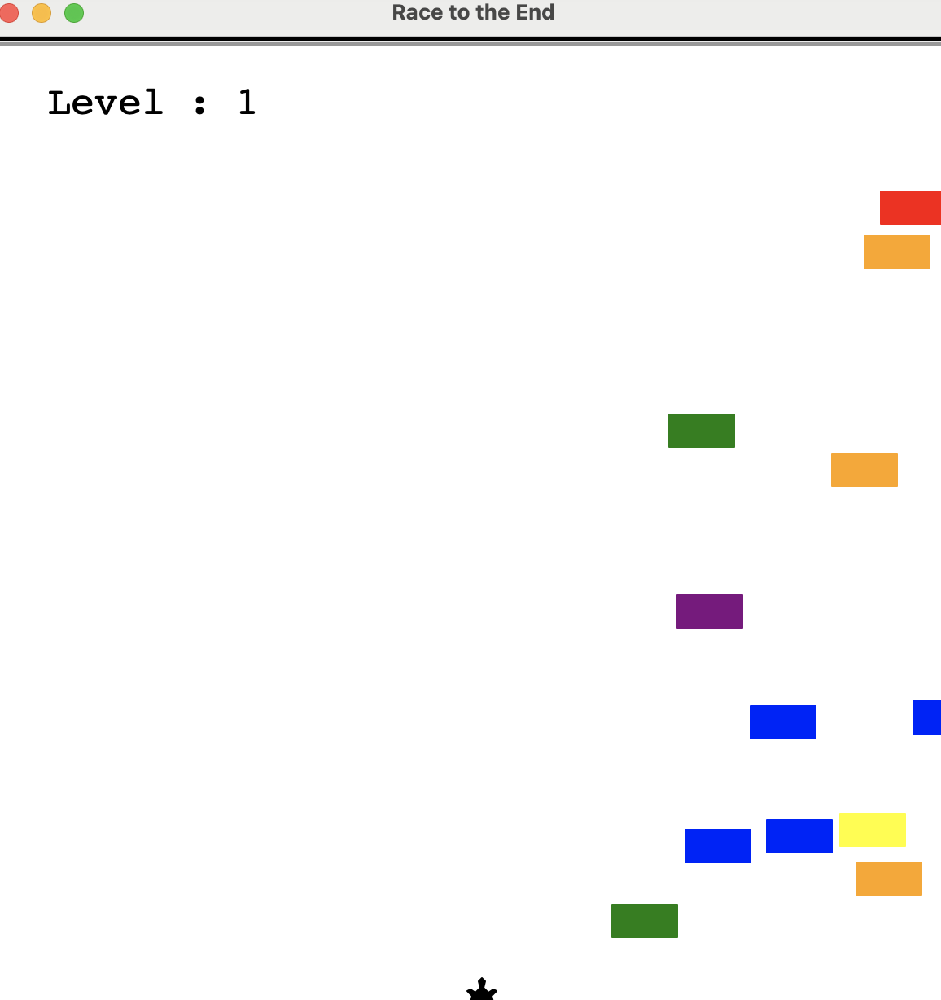

# Avoid Cars Game

A fun and challenging game where players control a character trying to avoid oncoming cars while racing to the finish line. Built using Python's `turtle` module, this game tests reflexes and timing.



## Table of Contents

- [Features](#features)
- [Usage](#usage)
- [Code Structure](#code-structure)
- [License](#license)

## Features

- Control a player character with keyboard input.
- Avoid randomly generated cars that move towards the player.
- Score tracking with an increasing challenge as the game progresses.

## Usage

Run the game by executing the `avoid_cars_game` function in your Python environment:

```bash
python avoid_cars_game.py
```

## Code Structure

The project consists of the following main components:

- `avoid_cars_game.py`: Main file that runs the game logic.
- `player.py`: Contains the `Player` class that manages player movement.
- `car_manager.py`: Contains the `CarManager` class that handles car generation and movement.
- `scoreboard.py`: Manages the score display and game-over conditions.

## How It Works

1. The player controls a character using the Up arrow key to move upward.
2. Cars are randomly generated at a 25% chance every 0.1 seconds and move toward the player.
3. If the player collides with a car, the game ends, and the score is displayed.
4. If the player reaches the finish line (y-coordinate > 290), their score increases, and the speed of the cars increases.

## License

This project is licensed under the MIT License. See the LICENSE file for details.
