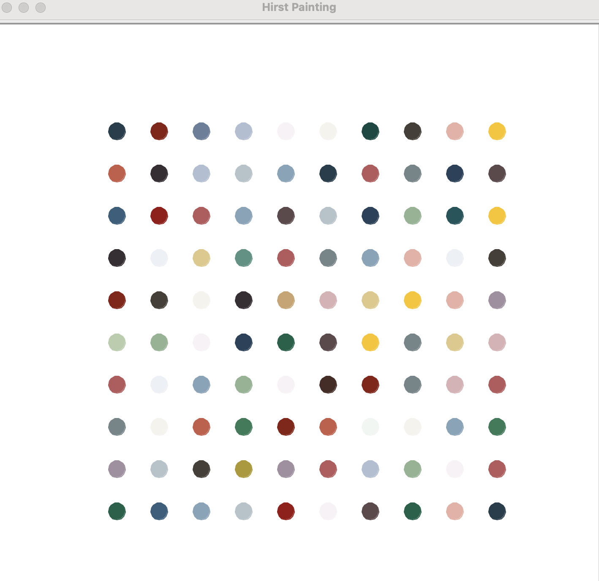

# Hirst Painting

A fun project that creates a digital version of a Hirst-inspired painting using Python's `turtle` module and the `colorgram` library. The program extracts colors from an image and uses them to draw colorful dots in a grid pattern.



## Table of Contents

- [Features](#features)
- [Installation](#installation)
- [Usage](#usage)
- [Code Structure](#code-structure)
- [License](#license)

## Features

- Extracts colors from an image using the `colorgram` library.
- Generates a grid of colored dots using the extracted colors.
- Customizable size and arrangement of the dots.

## Installation

To run the project, ensure you have Python installed on your machine. You also need to install the `colorgram.py` library.

1. Clone this folder or download the code files.
2. Navigate to the project directory in your terminal.
3. Install the required library:

```bash
pip install colorgram.py
```

4. Place an image named `hirst.jpg` in a folder named `Hirst` within the project directory. You can replace it with any image of your choice.

## Usage

Run the painting program by executing the `hirst_painting` function in your Python environment:

```bash
python hirst_painting.py
```

## Code Structure

The project consists of the following main components:

- `hirst_painting.py`: Main file that creates the painting.
- `colorgram.py`: Library used for color extraction.

## How It Works

1. The program extracts a set number of colors from the specified image.
2. It uses the `turtle` module to draw a grid of circles filled with randomly chosen colors from the extracted palette.
3. The painting can be closed by clicking on the Turtle graphics window.


## License

This project is licensed under the MIT License. See the LICENSE file for details.
