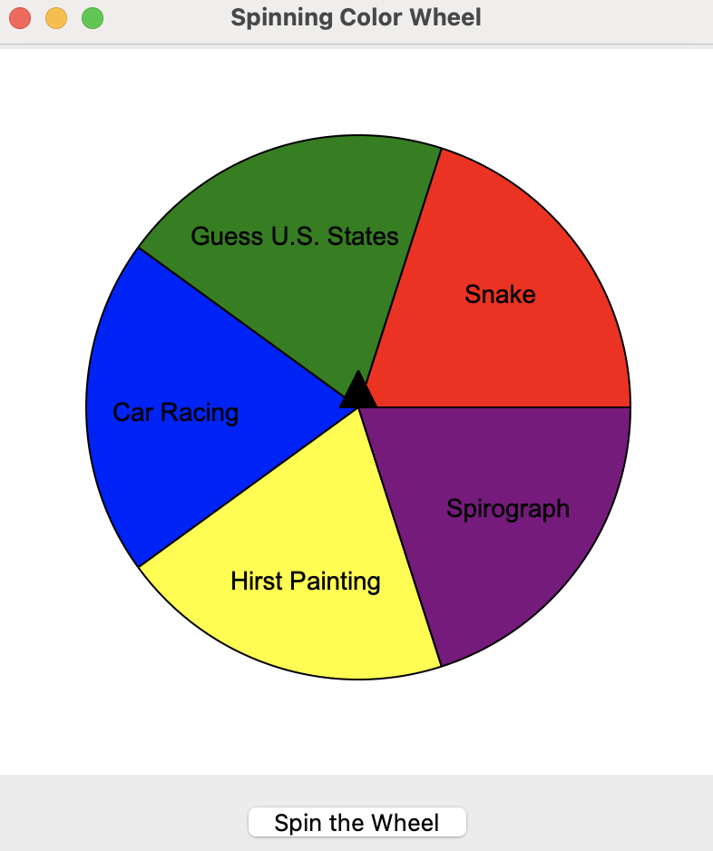

# Spinning Wheel Game

A fun interactive Python program that utilizes Tkinter and Turtle graphics. It combines multiple mini-games into a single spinning wheel interface. Users can spin the wheel to select from games like Spirograph, Snake, U.S. States Quiz, Car Racing, and Hirst Painting. Each selection prompts the user for confirmation before launching the respective game. 

I developed this application as a part of the Udemy course [100 Days of Code: The Complete Python Pro Bootcamp](http://www.udemy.com/course/100-days-of-code/). I thank Angela Yu and her team for this excellent course and I would highly recommend it to anyone interested in learning and enhancing their coding skills in Python. 

Spin the wheel to randomly select one of five engaging mini-games!



## Table of Contents

- [Features](#features)
- [Installation](#installation)
- [Mini-Games](#mini-games)
- [Contributing](#contributing)
- [License](#license)

## Features

- Interactive spinning wheel that randomly selects a mini-game.
- Confirmation prompts before launching selected games.
- Visual representation using the Tkinter library and Turtle graphics for the GUI.
- Includes a variety of mini-games developed in Python.

## Installation

1. Clone the repository:
   ```
   git clone https://github.com/yourusername/your-repo.git

2. Navigate to the project directory:

3. Install the required dependencies:
   ```
   pip install -r requirements.txt

4. Run the main program to start the spinning wheel game.

5. Ensure that the following mini-game files are in their respective folders:
   - `Spirograph` (contains `spirograph.py`)
   - `Snake` (contains `snake_game.py`)
   - `Avoid_cars_game` (contains `avoid_cars.py`)
   - `US_states_game` (contains `states_game.py`)
   - `Hirst` (contains `hirst_painting.py`)

## Mini-Games

- Hirst Art: Creates a painting inspired by Damien Hirst. It samples colors from a source painting and generates a grid of colors.
- Spirograph: Draws intricate spirograph patterns based on user input, showcasing the beauty of mathematical art.
- Snake Game: Navigate a snake on the screen, avoiding obstacles and collecting items to grow your score.
- Race to the End: Help a turtle cross the street while avoiding cars moving from right to left. A fun test of timing and reflexes!
- U.S. States Game: A guessing game where players identify U.S. states based on prompts, enhancing geographical knowledge.

## Contributing

Contributions are welcome! 

## License

This project is licensed under the MIT License. See the LICENSE file for details.
