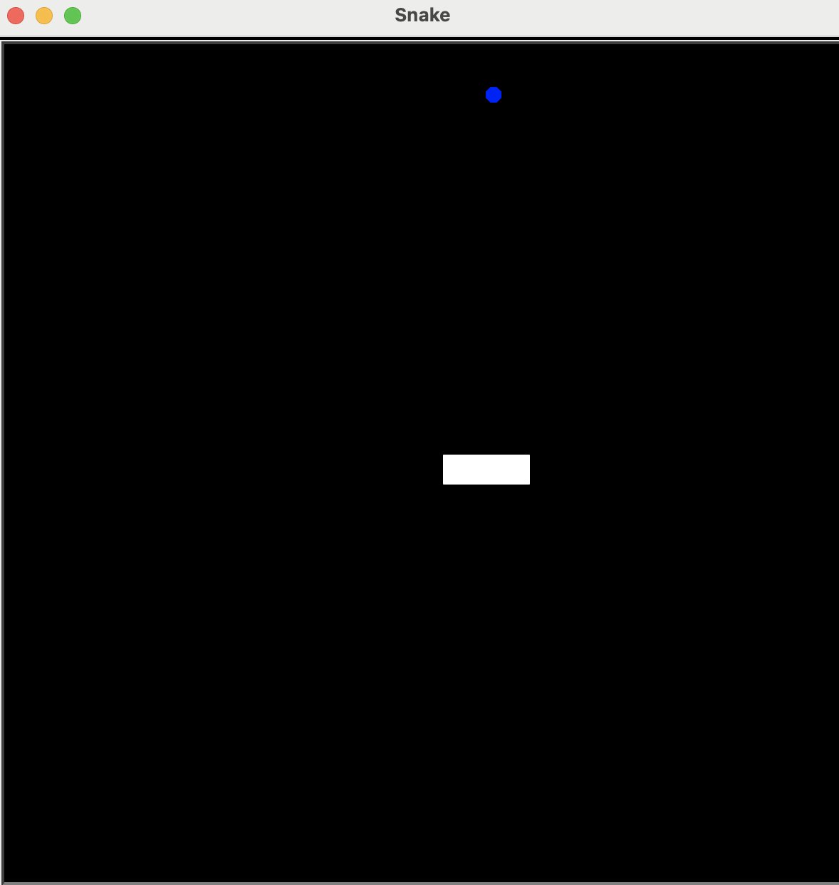

# Snake Game

A simple implementation of the classic Snake game using Python's `turtle` module. The player controls a snake that grows longer by eating food while avoiding collisions with the walls and itself.



## Table of Contents

- [Features](#features)
- [Installation](#installation)
- [Usage](#usage)
- [Gameplay](#gameplay)
- [Code Structure](#code-structure)
- [License](#license)

## Features

- Classic Snake gameplay mechanics
- Snake growth upon eating food
- Score tracking
- Game over conditions

## Installation

To run the game, ensure you have Python installed on your machine. You can download it from [python.org](https://www.python.org/downloads/).

1. Clone this repository or download the code files.
2. Navigate to the project directory in your terminal.

## Usage

Run the game by executing the `snake_game` function in your Python environment:

```bash
python snake_game.py
```

## Gameplay

- Use the arrow keys to control the snake:
  - **Up Arrow**: Move up
  - **Down Arrow**: Move down
  - **Left Arrow**: Move left
  - **Right Arrow**: Move right
- The snake grows longer each time it eats food, and your score increases.
- The game ends if the snake collides with the wall or itself.

## Code Structure

The game consists of the following main components:

- `snake.py`: Contains the `Snake` class responsible for the snake's movement and growth.
- `food.py`: Contains the `Food` class which manages the food's appearance and movement.
- `scoreboard.py`: Manages the scoring system and displays the score.
- `snake_game.py`: Main file to run the game and manage the game loop.


## License

This project is licensed under the MIT License. See the LICENSE file for details.
