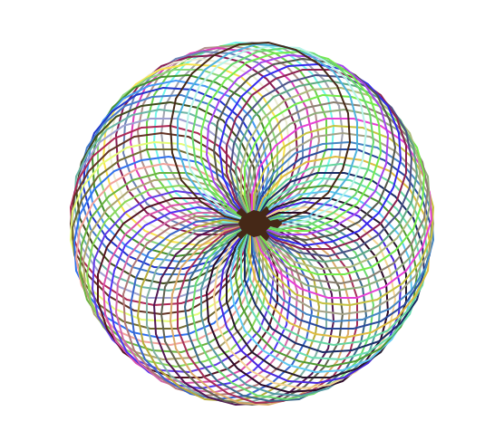

# Spirograph Drawing

A creative project that generates colourful spirographs using Python's `turtle` module. This program uses random coulors to create visually appealing patterns.



## Table of Contents

- [Features](#features)
- [Installation](#installation)
- [Usage](#usage)
- [Code Structure](#code-structure)
- [License](#license)

## Features

- Generates colourful spirograph patterns.
- Utilizes random RGB colours for each line segment.
- Fast drawing speed for a smooth visual experience.

## Installation

To run the project, ensure you have Python installed on your machine.

1. Clone this repository or download the code files.

## Usage

Run the program by executing the `create_spirograph` function in your Python environment:

```bash
python spirograph.py
```

## Code Structure

The project consists of the following main components:

- `spirograph.py`: Main file that creates the spirograph drawing.

## How It Works

1. The program initializes a `Turtle` object to draw the spirograph.
2. A color function generates random RGB values for each segment of the spirograph.
3. The turtle draws circles while rotating slightly to create the spirograph effect.
4. The drawing continues until the turtle completes the specified number of circles.


## License

This project is licensed under the MIT License. See the LICENSE file for details.
