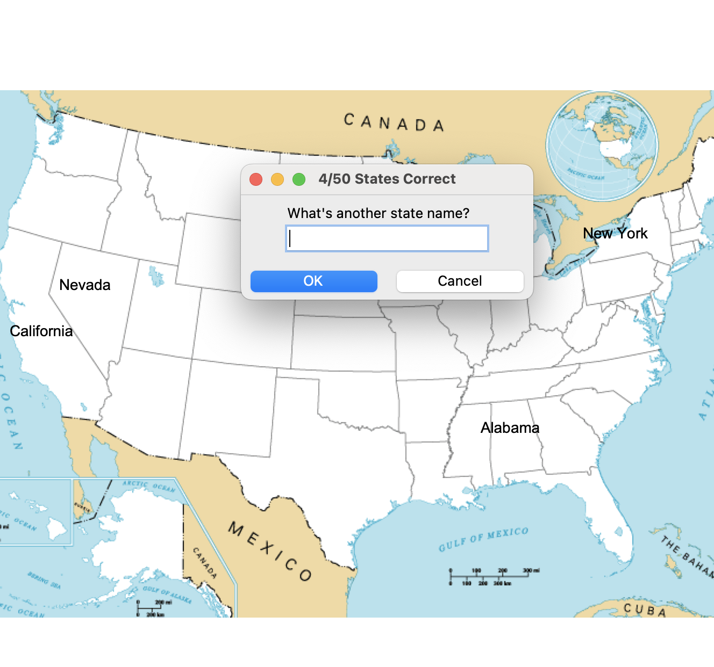

# U.S. States Game

A fun and educational game that challenges players to name all 50 U.S. states using Python's `turtle` module and `pandas` library. Players are prompted to input state names, and the game visually marks the correct answers on a map.



## Table of Contents

- [Features](#features)
- [Installation](#installation)
- [Usage](#usage)
- [Code Structure](#code-structure)
- [License](#license)

## Features

- Interactive game that tests knowledge of U.S. states.
- Visual feedback on a map of the United States.
- Tracks score and allows for exiting the game.

## Installation

To run the game, ensure you have Python installed on your machine. You will also need to install the `pandas` library.

1. Clone this repository or download the code files.
2. Navigate to the project directory in your terminal.
3. Install the required library:

```bash
pip install pandas
```

4. Place the CSV file (`50_states.csv`) and the image file (`blank_states_img.gif`) in a folder named `US_states_game` within the project directory. You can find a suitable states image online.

## Usage

Run the game by executing the `states_game` function in your Python environment:

```bash
python states_game.py
```

## Code Structure

The project consists of the following main components:

- `states_game.py`: Main file that runs the game.
- `50_states.csv`: A CSV file containing state names and their coordinates.
- `blank_states_img.gif`: An image of the U.S. map used as the game background.

## How It Works

1. The program loads the states' data from the CSV file and displays a map of the United States.
2. Players input state names into a prompt. Correctly guessed states are marked on the map.
3. The game tracks the player's score and provides an option to exit by typing "Exit."

## License

This project is licensed under the MIT License. See the LICENSE file for details.
